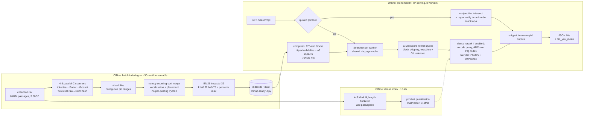

# search-engine — production-grade search on one M1 MacBook Air

A ground-up search engine (Google-style core: indexing, BM25 ranked retrieval,
evolving toward pruned top-k, hybrid ranking, and distribution), built
benchmark-first. Tutorial here: [https://youtu.be/udH8gNdRvMA](https://youtu.be/udH8gNdRvMA)

## Final Architecture



## Run it

```bash
# data (once): MS MARCO passage collection + dev queries + qrels
mkdir -p data && cd data
curl -LO https://msmarco.z22.web.core.windows.net/msmarcoranking/collectionandqueries.tar.gz
tar xzf collectionandqueries.tar.gz && cd ..

# build the full index (~25s; needs numpy + clang; auto-compiles scanner)
python3 -m searchengine.indexer_v4 data/collection.tsv indexes/v1s 8

# serve: pre-forked HTTP on :8080 with 8 workers (raw arrays — the default,
# fastest format: p50 0.86ms, p99 12.6ms, 2.79GB hot)
python3 -m searchengine.server indexes/v1s data/collection.tsv 8080 8
curl 'http://127.0.0.1:8080/search?q=what+is+the+manhattan+project&k=5'
curl 'http://127.0.0.1:8080/search?q=manhatan+projct'   # → did_you_mean
curl 'http://127.0.0.1:8080/suggest?q=how+do+i+cook'    # → autocomplete
curl 'http://127.0.0.1:8080/search?q="cost+of+living"'  # → exact phrase

# regression suite
python3 -m pytest tests/ -q
```

### Capacity mode (optional): the block-compressed index

3.65x smaller hot set (764MB vs 2.79GB) at ~1.7x the median latency; same
quality to within quantization noise (MRR delta 4e-5). Use it when the corpus
outgrows the machine — the server auto-detects the format.

```bash
python3 -m searchengine.compress_index indexes/v1s indexes/v2c
cp indexes/v1s/lineoffsets.i64.npy indexes/v1s/surface_df.pkl indexes/v2c/ 2>/dev/null
python3 -m searchengine.server indexes/v2c data/collection.tsv 8080 8
```

## Dense reranking (hybrid) — build and resume

```bash
# 1. train the PQ codebook on a uniform corpus sample (~20 min)
python3 -m searchengine.embed_corpus train 200000 indexes/dense 96

# 2. encode the corpus (~10h; resumable — rerun the same command anytime,
#    it skips completed shards and never leaves a half-written index)
python3 -m searchengine.embed_corpus run indexes/dense
python3 -m searchengine.embed_corpus status indexes/dense   # progress
python3 -m searchengine.embed_corpus verify indexes/dense   # no unwritten rows

# 3. evaluate (the harness refuses headline numbers below 100% coverage)
python3 -m bench.hybrid.bench_hybrid indexes/v1s indexes/dense

# honest end-to-end build benchmark (EVICT=1 for a cold-cache measurement)
EVICT=1 python3 -m bench.build.bench_build data/collection.tsv /tmp/bb 4
```

## Other entry points

```bash
python3 -m searchengine.cli_v1 indexes/v1s data/collection.tsv        # REPL
python3 -m bench.v1.bench_v1 data indexes/v1s bench/results/latest.json
python3 -m bench.serving.loadgen 8080 4 4 10 1                       # HTTP load
```

## Browser UI

```bash
python3 -m searchengine.server indexes/v1s data/collection.tsv 8080 8
open http://127.0.0.1:8080/          # search box, autocomplete, did-you-mean
curl http://127.0.0.1:8080/metrics   # latency percentiles, cache hit rate
```

## Incremental indexing (no rebuild to add documents)

```python
from searchengine.live.writer import IndexWriter
from searchengine.live.reader import LiveSearcher, IndexMerger

w = IndexWriter("indexes/live")
w.add_many(["first document", "second document"]); w.commit()   # searchable now
LiveSearcher("indexes/live").search("document", 10)
w.delete([0])                                                    # tombstone
IndexMerger("indexes/live", max_segments=8).maybe_merge()        # consolidate
```
Writes run at ~37K docs/s; each live segment adds ~0.15ms to a query, and
merging restores exact agreement with a full rebuild (notes/20).

## Continuous crawl → index → searchable

```bash
python3 -m searchengine.live.crawl_index data/seeds.txt indexes/livecrawl 2000 400
```

## Web crawl → searchable web index

```bash
python3 -m searchengine.crawler data/seeds.txt data/crawl 20000 32
python3 -m searchengine.build_web_index data/crawl indexes/web
python3 -m searchengine.pagerank data/crawl          # top pages by authority
```
Crawler obeys robots.txt, serialises per host, backs off on 429/503, and
isolates failures per page. `build_web_index` drops non-English pages (otherwise BM25's length
normalisation rewards them — see notes/16). PageRank is computed and stored
but **off by default** (`beta=0`): on a 7k-page crawl it measurably HURTS
ranking (notes/25). Best measured config is hybrid α=0.3, β=0 —
nDCG@10 0.7921 vs 0.6464 for BM25 alone, on pooled LLM judgments.

## Distributed (sharding + replication)

```bash
# build 4 shards WITH global collection statistics (see notes/17 — without
# them, sharding silently changes 8.7% of top-10 results)
python3 -c "from searchengine.distributed.shard_build import build_shards; \
  import json; print(json.dumps(build_shards('data/collection.tsv', \
  'indexes/shards', 4, True, existing_index='indexes/v1s'), indent=2))"

for i in 0 1 2 3; do python3 -m searchengine.distributed.shard_server \
  indexes/shards/shard$i/idx $((8110+i)) & done
python3 -m searchengine.distributed.broker 8110 8111 8112 8113 --port 9000
python3 -m bench.distributed.bench_dist 9000 global 1000
```
Replicas: pass `8110,8130` for a shard. Measured verdict: on ONE machine
this is 4.8x slower than single-node — distribution buys capacity and
availability, not speed (notes/17).# forex-search-engine-
